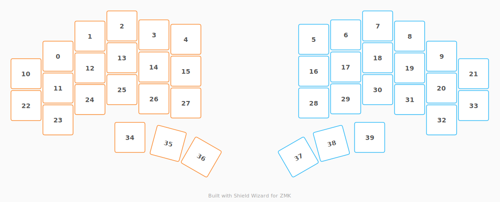

# ZMK Configuration for Totem Plus 1

*Generated by Shield Wizard for ZMK*



Download compiled firmware from the Actions tab. <https://zmk.dev/docs/user-setup#installing-the-firmware>

Edit your keymap <https://zmk.dev/docs/keymaps>.
User keymap is located at [`config/totem_plus_1.keymap`](config/totem_plus_1.keymap).

-----

<details>
<summary>
Shield Wizard Debug Information
</summary>

In case of broken configuration, here is the Shield Wizard internal data used to generate this configuration:

Commit: d97539af50adf6e6b814e78f61634808d9217881

```json
{"name":"Totem Plus 1","shield":"totem_plus_1","dongle":false,"modules":[],"layout":[{"id":"01KWMRQDVE1VQ39ASXBGDA6RD9","part":0,"row":0,"col":0,"w":1,"h":1,"x":-1,"y":0.95,"r":0,"rx":0,"ry":0},{"id":"01KWMRQDVFT0YQZRXFQGEN2VBG","part":0,"row":0,"col":1,"w":1,"h":1,"x":0,"y":0.32,"r":0,"rx":0,"ry":0},{"id":"01KWMRQDVFMA04H3TEXEQAXAST","part":0,"row":0,"col":2,"w":1,"h":1,"x":1,"y":0,"r":0,"rx":0,"ry":0},{"id":"01KWMRQDVFR90X5NWNWR4D6H92","part":0,"row":0,"col":3,"w":1,"h":1,"x":2,"y":0.28,"r":0,"rx":0,"ry":0},{"id":"01KWMRQDVF06GCSCK6Y6Y65S7V","part":0,"row":0,"col":4,"w":1,"h":1,"x":3,"y":0.42,"r":0,"rx":0,"ry":0},{"id":"01KWMRQDVFVXEME2R13TCJFPYF","part":1,"row":0,"col":5,"w":1,"h":1,"x":7,"y":0.42,"r":0,"rx":0,"ry":0},{"id":"01KWMRQDVFAV67PRV7DDH56Z01","part":1,"row":0,"col":6,"w":1,"h":1,"x":8,"y":0.28,"r":0,"rx":0,"ry":0},{"id":"01KWMRQDVFW61DK83HXNZDSCDV","part":1,"row":0,"col":7,"w":1,"h":1,"x":9,"y":0,"r":0,"rx":0,"ry":0},{"id":"01KWMRQDVFYCE8GRJEN47YDC0F","part":1,"row":0,"col":8,"w":1,"h":1,"x":10,"y":0.32,"r":0,"rx":0,"ry":0},{"id":"01KWMRQDVFY6FF7BYC6MGEAZ4J","part":1,"row":0,"col":9,"w":1,"h":1,"x":11,"y":0.95,"r":0,"rx":0,"ry":0},{"id":"01KWMRR276R0CY9RHJNTXHTB44","part":0,"row":1,"col":-1,"w":1,"h":1,"x":-2,"y":1.5,"r":0,"rx":0,"ry":0},{"id":"01KWMRQDVFRAPFT0MYGRX3BATE","part":0,"row":1,"col":0,"w":1,"h":1,"x":-1,"y":1.95,"r":0,"rx":0,"ry":0},{"id":"01KWMRQDVF36A26CSHV084V47K","part":0,"row":1,"col":1,"w":1,"h":1,"x":0,"y":1.32,"r":0,"rx":0,"ry":0},{"id":"01KWMRQDVFEA24GRK7BVRFA967","part":0,"row":1,"col":2,"w":1,"h":1,"x":1,"y":1,"r":0,"rx":0,"ry":0},{"id":"01KWMRQDVFMG29M8GPHGT17J8H","part":0,"row":1,"col":3,"w":1,"h":1,"x":2,"y":1.29,"r":0,"rx":0,"ry":0},{"id":"01KWMRQDVFSDJ2W3WASYQ7R35Z","part":0,"row":1,"col":4,"w":1,"h":1,"x":3,"y":1.42,"r":0,"rx":0,"ry":0},{"id":"01KWMRQDVFFRCCB8BND3VWXHGJ","part":1,"row":1,"col":5,"w":1,"h":1,"x":7,"y":1.42,"r":0,"rx":0,"ry":0},{"id":"01KWMRQDVFVKEFD6ZKWJ9M1ZZE","part":1,"row":1,"col":6,"w":1,"h":1,"x":8,"y":1.29,"r":0,"rx":0,"ry":0},{"id":"01KWMRQDVF79HC4F04S5MCPNGP","part":1,"row":1,"col":7,"w":1,"h":1,"x":9,"y":1,"r":0,"rx":0,"ry":0},{"id":"01KWMRQDVFY8WS3WQ05MK2ZK94","part":1,"row":1,"col":8,"w":1,"h":1,"x":10,"y":1.32,"r":0,"rx":0,"ry":0},{"id":"01KWMRQDVF678MWTMB6EP3EFRQ","part":1,"row":1,"col":9,"w":1,"h":1,"x":11,"y":1.95,"r":0,"rx":0,"ry":0},{"id":"01KWMRR4G4YJBZQT3F6PYMR1WK","part":1,"row":1,"col":10,"w":1,"h":1,"x":12,"y":1.5,"r":0,"rx":0,"ry":0},{"id":"01KWMRR14EZPGKJ01N0MN1FA96","part":0,"row":2,"col":-1,"w":1,"h":1,"x":-2,"y":2.5,"r":0,"rx":0,"ry":0},{"id":"01KWMRQDVFBWDTND4VA5NQB118","part":0,"row":2,"col":0,"w":1,"h":1,"x":-1,"y":2.95,"r":0,"rx":0,"ry":0},{"id":"01KWMRQDVFRM45401YP4C34F03","part":0,"row":2,"col":1,"w":1,"h":1,"x":0,"y":2.31,"r":0,"rx":0,"ry":0},{"id":"01KWMRQDVFH2K4CFPZPXB4VXP2","part":0,"row":2,"col":2,"w":1,"h":1,"x":1,"y":2,"r":0,"rx":0,"ry":0},{"id":"01KWMRQDVFMBV5K58M7KM11QBF","part":0,"row":2,"col":3,"w":1,"h":1,"x":2,"y":2.29,"r":0,"rx":0,"ry":0},{"id":"01KWMRQDVF1XJGPC06MXREC4PP","part":0,"row":2,"col":4,"w":1,"h":1,"x":3,"y":2.42,"r":0,"rx":0,"ry":0},{"id":"01KWMRQDVFSHF8EGC85QFKRABC","part":1,"row":2,"col":5,"w":1,"h":1,"x":7,"y":2.42,"r":0,"rx":0,"ry":0},{"id":"01KWMRQDVFA2NQR2WCZK4XQTSX","part":1,"row":2,"col":6,"w":1,"h":1,"x":8,"y":2.29,"r":0,"rx":0,"ry":0},{"id":"01KWMRQDVFHX9YSTZC1592A9AZ","part":1,"row":2,"col":7,"w":1,"h":1,"x":9,"y":2,"r":0,"rx":0,"ry":0},{"id":"01KWMRQDVFJM0MY2SG150HF8R5","part":1,"row":2,"col":8,"w":1,"h":1,"x":10,"y":2.31,"r":0,"rx":0,"ry":0},{"id":"01KWMRQDVFRAV1GYVS0TRTXDRW","part":1,"row":2,"col":9,"w":1,"h":1,"x":11,"y":2.95,"r":0,"rx":0,"ry":0},{"id":"01KWMRR3XYRM4W6VPNKYSEG27H","part":1,"row":2,"col":10,"w":1,"h":1,"x":12,"y":2.5,"r":0,"rx":0,"ry":0},{"id":"01KWMRSCE9QF7FC8Q3N2EG7Z5D","part":0,"row":3,"col":2,"w":1,"h":1,"x":1.25,"y":3.5,"r":0,"rx":0,"ry":0},{"id":"01KWMRQDVFPY05JDN76W0TC14M","part":0,"row":3,"col":3,"w":1,"h":1,"x":2.3,"y":3.8,"r":15,"rx":3.3,"ry":4.8},{"id":"01KWMRQDVFHMM1G1DGEYZVFC3J","part":0,"row":3,"col":4,"w":1,"h":1,"x":3.3,"y":3.8,"r":30,"rx":3.3,"ry":4.8},{"id":"01KWMRQDVFBVSB167T751XDQ4R","part":1,"row":3,"col":5,"w":1,"h":1,"x":6.7,"y":3.8,"r":-30,"rx":7.7,"ry":4.8},{"id":"01KWMRQDVFHPBNE6ZGVEJ0D4ZP","part":1,"row":3,"col":6,"w":1,"h":1,"x":7.7,"y":3.8,"r":-15,"rx":7.7,"ry":4.8},{"id":"01KWMRV6WJZ9A74R4D5CMTYV8Z","part":1,"row":3,"col":7,"w":1,"h":1,"x":8.75,"y":3.5,"r":0,"rx":0,"ry":0}],"parts":[{"name":"left","controller":"nice_nano_v2","pins":{"d2":{"usage":"kscan","kscan":"01KWMRWW7XKSG00EJ1TNW857BS","role":"input"},"d3":{"usage":"kscan","kscan":"01KWMRWW7XKSG00EJ1TNW857BS","role":"input"},"d4":{"usage":"kscan","kscan":"01KWMRWW7XKSG00EJ1TNW857BS","role":"input"},"d5":{"usage":"kscan","kscan":"01KWMRWW7XKSG00EJ1TNW857BS","role":"input"},"d21":{"usage":"kscan","kscan":"01KWMRWW7XKSG00EJ1TNW857BS","role":"output"},"d20":{"usage":"kscan","kscan":"01KWMRWW7XKSG00EJ1TNW857BS","role":"output"},"d19":{"usage":"kscan","kscan":"01KWMRWW7XKSG00EJ1TNW857BS","role":"output"},"d18":{"usage":"kscan","kscan":"01KWMRWW7XKSG00EJ1TNW857BS","role":"output"},"d15":{"usage":"kscan","kscan":"01KWMRWW7XKSG00EJ1TNW857BS","role":"output"},"d14":{"usage":"kscan","kscan":"01KWMRWW7XKSG00EJ1TNW857BS","role":"output"}},"kscans":[{"kind":"matrix","id":"01KWMRWW7XKSG00EJ1TNW857BS","diodes":true}],"keys":{"01KWMRQDVE1VQ39ASXBGDA6RD9":{"input":"d2","output":"d15"},"01KWMRQDVFT0YQZRXFQGEN2VBG":{"input":"d2","output":"d18"},"01KWMRQDVFMA04H3TEXEQAXAST":{"input":"d2","output":"d19"},"01KWMRQDVFR90X5NWNWR4D6H92":{"input":"d2","output":"d20"},"01KWMRQDVF06GCSCK6Y6Y65S7V":{"input":"d2","output":"d21"},"01KWMRR276R0CY9RHJNTXHTB44":{"input":"d3","output":"d14"},"01KWMRQDVFRAPFT0MYGRX3BATE":{"input":"d3","output":"d15"},"01KWMRQDVF36A26CSHV084V47K":{"input":"d3","output":"d18"},"01KWMRQDVFEA24GRK7BVRFA967":{"input":"d3","output":"d19"},"01KWMRQDVFMG29M8GPHGT17J8H":{"input":"d3","output":"d20"},"01KWMRQDVFSDJ2W3WASYQ7R35Z":{"input":"d3","output":"d21"},"01KWMRR14EZPGKJ01N0MN1FA96":{"input":"d4","output":"d14"},"01KWMRQDVFBWDTND4VA5NQB118":{"input":"d4","output":"d15"},"01KWMRQDVFRM45401YP4C34F03":{"input":"d4","output":"d18"},"01KWMRQDVFH2K4CFPZPXB4VXP2":{"input":"d4","output":"d19"},"01KWMRQDVFMBV5K58M7KM11QBF":{"input":"d4","output":"d20"},"01KWMRQDVF1XJGPC06MXREC4PP":{"input":"d4","output":"d21"},"01KWMRSCE9QF7FC8Q3N2EG7Z5D":{"input":"d5","output":"d19"},"01KWMRQDVFPY05JDN76W0TC14M":{"input":"d5","output":"d20"},"01KWMRQDVFHMM1G1DGEYZVFC3J":{"input":"d5","output":"d21"}},"encoders":[],"buses":{}},{"name":"right","controller":"nice_nano_v2","pins":{"d2":{"usage":"kscan","kscan":"01KWMRZFSEZ3H7YJMACY8KEQPR","role":"input"},"d3":{"usage":"kscan","kscan":"01KWMRZFSEZ3H7YJMACY8KEQPR","role":"input"},"d4":{"usage":"kscan","kscan":"01KWMRZFSEZ3H7YJMACY8KEQPR","role":"input"},"d5":{"usage":"kscan","kscan":"01KWMRZFSEZ3H7YJMACY8KEQPR","role":"input"},"d21":{"usage":"kscan","kscan":"01KWMRZFSEZ3H7YJMACY8KEQPR","role":"output"},"d20":{"usage":"kscan","kscan":"01KWMRZFSEZ3H7YJMACY8KEQPR","role":"output"},"d19":{"usage":"kscan","kscan":"01KWMRZFSEZ3H7YJMACY8KEQPR","role":"output"},"d18":{"usage":"kscan","kscan":"01KWMRZFSEZ3H7YJMACY8KEQPR","role":"output"},"d15":{"usage":"kscan","kscan":"01KWMRZFSEZ3H7YJMACY8KEQPR","role":"output"},"d14":{"usage":"kscan","kscan":"01KWMRZFSEZ3H7YJMACY8KEQPR","role":"output"}},"kscans":[{"kind":"matrix","id":"01KWMRZFSEZ3H7YJMACY8KEQPR","diodes":true}],"keys":{"01KWMRQDVFVXEME2R13TCJFPYF":{"input":"d2","output":"d21"},"01KWMRQDVFAV67PRV7DDH56Z01":{"input":"d2","output":"d20"},"01KWMRQDVFW61DK83HXNZDSCDV":{"input":"d2","output":"d19"},"01KWMRQDVFYCE8GRJEN47YDC0F":{"input":"d2","output":"d18"},"01KWMRQDVFY6FF7BYC6MGEAZ4J":{"input":"d2","output":"d15"},"01KWMRQDVFFRCCB8BND3VWXHGJ":{"input":"d3","output":"d21"},"01KWMRQDVFVKEFD6ZKWJ9M1ZZE":{"input":"d3","output":"d20"},"01KWMRQDVF79HC4F04S5MCPNGP":{"input":"d3","output":"d19"},"01KWMRQDVFY8WS3WQ05MK2ZK94":{"input":"d3","output":"d18"},"01KWMRQDVF678MWTMB6EP3EFRQ":{"input":"d3","output":"d15"},"01KWMRR4G4YJBZQT3F6PYMR1WK":{"input":"d3","output":"d14"},"01KWMRQDVFSHF8EGC85QFKRABC":{"input":"d4","output":"d21"},"01KWMRQDVFA2NQR2WCZK4XQTSX":{"input":"d4","output":"d20"},"01KWMRQDVFHX9YSTZC1592A9AZ":{"input":"d4","output":"d19"},"01KWMRQDVFJM0MY2SG150HF8R5":{"input":"d4","output":"d18"},"01KWMRQDVFRAV1GYVS0TRTXDRW":{"input":"d4","output":"d15"},"01KWMRR3XYRM4W6VPNKYSEG27H":{"input":"d4","output":"d14"},"01KWMRQDVFBVSB167T751XDQ4R":{"input":"d5","output":"d21"},"01KWMRQDVFHPBNE6ZGVEJ0D4ZP":{"input":"d5","output":"d20"},"01KWMRV6WJZ9A74R4D5CMTYV8Z":{"input":"d5","output":"d19"}},"encoders":[],"buses":{}}]}
```

</details>
